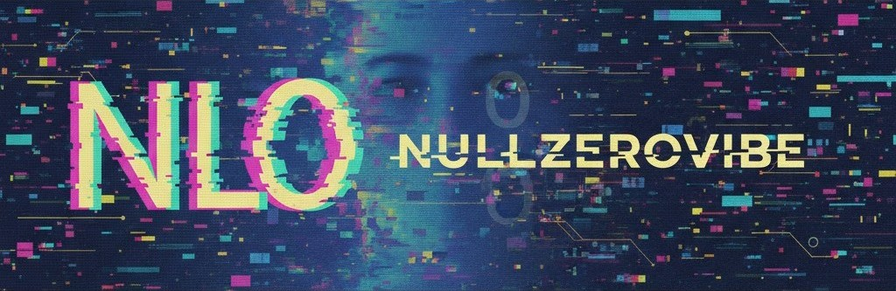

<div align="center">



# N u l l Z e r o V i b e
<pre>
▄▀▀▄░█▀▀█░█▀▀▄░█▀▀ 
█░░░░█░░█░█░░█░█▀▀ 
▀▄▄▀░█▄▄█░█▄▄▀░█▄▄ 
</pre>

` ░▒▒▓▓ LIFETIME OF SYNTAX // AGENTIC EVOLUTION ▓▓▒▒░ `

[](https://opensource.org/licenses/MIT)


</div>

---

# UoMConverter


 


**UoMConverter** is a high-performance, extensible unit of measure conversion library for .NET, leveraging source generators for maximum efficiency and a zero-allocation discovery path.

## Features

- 🚀 **High Performance**: Optimized conversions using pre-compiled formulas generated at compile-time.
- 🧩 **Extensible**: Easily add custom quantities and units via simple JSON definitions.
- 🏗️ **Source Generated**: The registry and all conversion logic are generated during build, reducing runtime overhead.
- 🛡️ **Type Safe**: Strong typing for quantities and units ensures reliability.
- 🧵 **Thread Safe**: Stateless design optimized for high-concurrency environments like Web APIs and WASM.
- 🗺️ **WASM Ready**: Designed for low memory footprint and fast startup in WebAssembly.

## Quick Start

### Installation

```bash
dotnet add package UoMConverter
```

### Basic Usage

The `UoMConverter` class provides a high-level API for easy unit conversion and discovery.

```csharp
using UoMConverter;

var converter = new UoMConverter.UoMConverter();

// Simple conversion by string names or abbreviations
double grams = converter.Convert(1.0, "Kilogram", "Gram");
Console.WriteLine($"1kg is {grams}g"); // Output: 1000

// Using abbreviations
double meters = converter.Convert(100, "cm", "m");
Console.WriteLine($"100cm is {meters}m"); // Output: 1
```

### Discovery API (UI Ready)

Perfect for populating dropdowns or search interfaces.

```csharp
var converter = new UoMConverter.UoMConverter();

// Get all available physical quantities
var dimensions = converter.GetDimensions(); // ["Mass", "Length", "Temperature", ...]

// Get unit list for a specific dimension with metadata
var units = converter.GetUnitList("Mass");
foreach (var (name, abbr, plural) in units)
{
    Console.WriteLine($"{name} ({abbr}) - {plural}");
}
```

## Advanced: Adding Custom Units

Create a JSON file in your project and include it as an `AdditionalFiles` item in your `.csproj`.

```json
{
  "Name": "Currency",
  "BaseUnit": "Credit",
  "Units": [
    {
      "SingularName": "Credit",
      "PluralName": "Credits",
      "FromUnitToBaseFunc": "val",
      "FromBaseToUnitFunc": "val",
      "Localization": [ { "Culture": "en-US", "Abbreviations": ["CR"] } ]
    },
    {
      "SingularName": "Gold",
      "PluralName": "Gold",
      "FromUnitToBaseFunc": "val * 100",
      "FromBaseToUnitFunc": "val / 100",
      "Localization": [ { "Culture": "en-US", "Abbreviations": ["GP"] } ]
    }
  ]
}
```

## Synchronization

Maintain unit definitions in sync with upstream sources (like UnitsNet) using the provided script:

```powershell
.\scripts\Sync-UnitsNet.ps1
```

## License

MIT

---

<div align="center">

### ◈ THE MANIFESTO

> **Legacy meets Autonomy.**
> After a lifetime of building the stack, I've moved beyond the keyboard. 
> I don't just write lines; I orchestrate intent. 
> This is **Vibecoding**: High-level reasoning, agentic execution, and zero friction.

</div>

### 🛠️ ARCHITECTURAL STACK
* **The Core:** Lifetime of Full-Stack Engineering & System Architecture.
* **The Shift:** 1 Year of Agentic Development & LLM Orchestration.
* **The Output:** 100% Open Source (MIT). I build for the commons.

### 🤖 CURRENT AGENTIC FOCUS
* **Autonomous Workflows:** Self-healing CI/CD and agent-led refactoring.
* **Vibe-Driven UI:** Rapid prototyping where the intent is the documentation.
* **Neural Tooling:** Building the next generation of developer experience.

---

### 📡 CONNECT / COLLABORATE
* **GitHub:** [nullzerovibe](https://github.com/nullzerovibe)
* **Email:** [nullzerovibe@gmail.com](mailto:nullzerovibe@gmail.com)
* **Status:** `[■■■■■■■■■□] Orchestrating the next vibe...`

---

<div align="center">

*Everything you find here is yours to fork, break, and build upon.*
**KEEP THE VIBE ALIVE.**

</div>
